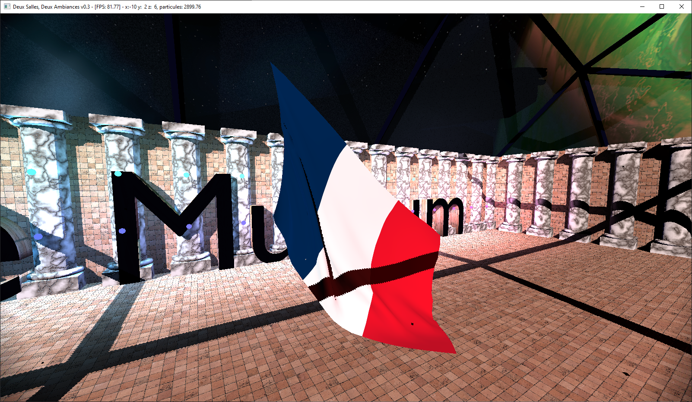
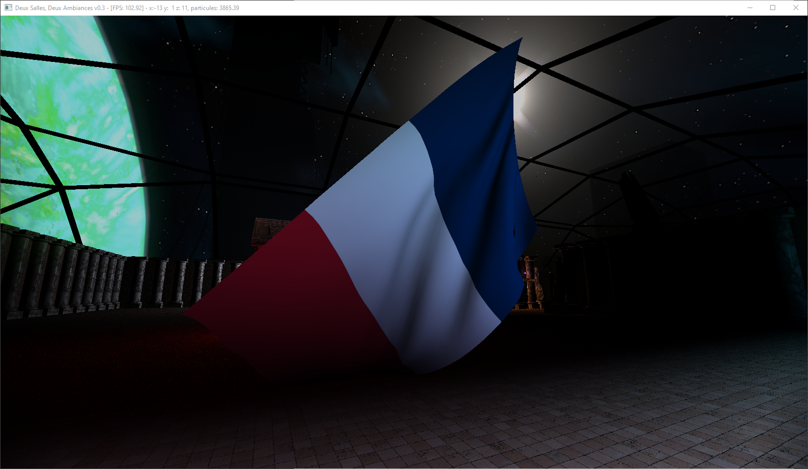
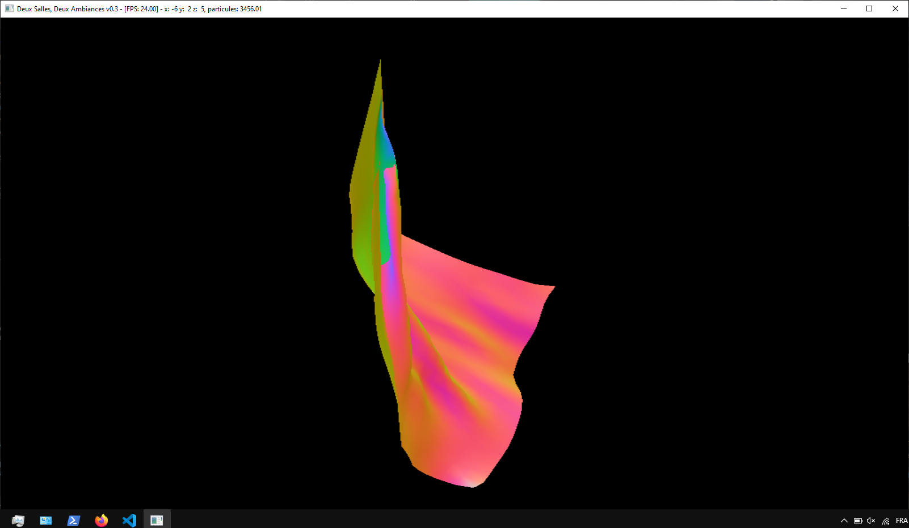
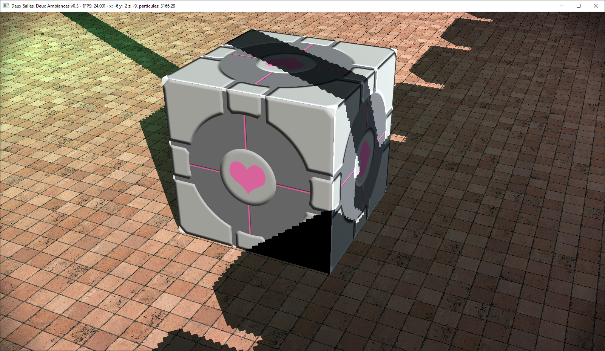
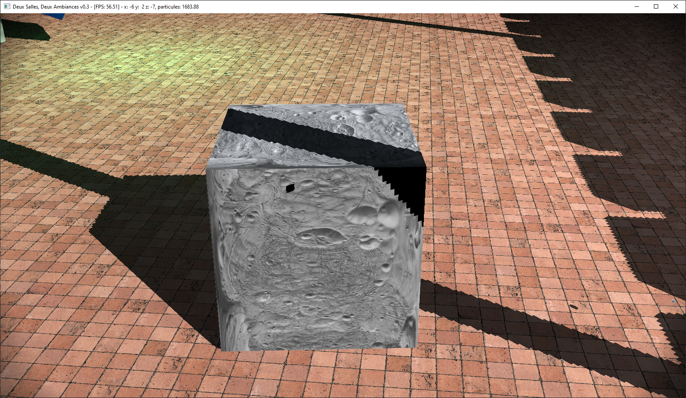
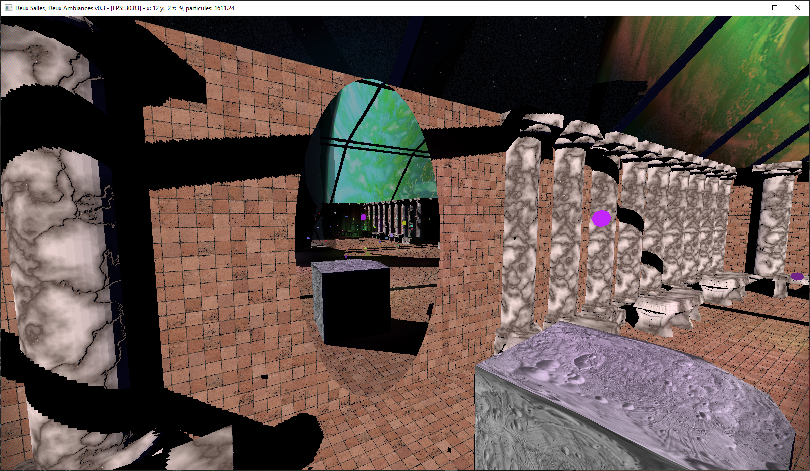

# Projet de simulation

Le programme à lancer est `ex_main_animation.cpp`

Pour le projet de simulation j'ai décider de faire un drapeau où le calcul de vent serait fait avec une texture de profondeur et de normals calculé sur le GPU avec openGL

J'ai aussi décider de faire une simulation simple de soft bodies

Les différents simulation ne possèdent pas de self collisons

Pour la suite du rapport, je vais présenter les différents classes liées à la partie simulation du programme, comme une sorte de doc/ explication de l'API

# Classe `Particule`

`Particule(float mass, vec3 pos, vec3 speed, ParticuleComputeType type)`

`Particule(float mass, vec3 pos, ParticuleComputeType type)`

`Particule(float mass, vec3 pos)`

- `mass`:  La masse de la particule
- `pos`:   La position initiale de la particule
- `speed`: La vitesse initiale de la particule
- `type`:  Le type de calcul de physique, enum: `ParticuleComputeType`
    - `fixed`
    - `euler`
    - `leapfrog`

Valeurs par defaut si non précisé:
- speed: `vec3(0)`
- type: `fixed`


## Méthodes

- `setType(ParticuleComputeType type)`

    Permet de modifier le type de calcul physique

    - `type`:  Le type de calcul de physique

- `update(float h)`

    Met à jour la particule

    - `h`: le delta temps

- `reset()`

    Réinitialise la particule à ses position/vitesse initiales

- `try_lock()`

    Permet de bloquer l'accès à la particule, à utiliser pour le calcul threadé

- `unlock()`

    Libère le loquet sur la particule

## Variables

- Publiques

    - float `m_mass`
    - vec3 `m_pos`
    - vec3 `m_speed`
    - vec3 `m_forces_acc`

- Privées

    - ParticuleComputeType `m_type`
    - vec3 `m_initial_pos`
    - vec3 `m_initial_speed`
    - std::mutex* `m_mutex`

# Classe `Link`

`Link(Particule *M1, Particule *M2)`

`Link(Particule *M1, Particule *M2, LinkType type, float length, float k, float z, float s)`

- `*M1`: Pointeur sur la 1ère particule
- `*M2`: Pointeur sur la 2ème particule
- `type`: le type de lien, présentés ci dessous
- `length`: la longeur au 'repos' de la liaison
- `k`: le coeficient de raideur
- `z`: le coeficient d'amortissement
- `s`: scalaire de la longueur d'activation de la liaison

Il est préférable de créer les liaisons sans paramètres et d'ensuite choisir le type de liaison avec les methodes suivantes:

1. lien ressort

    `make_hook_spring(float k)`

    - `k`: le coeficient de raideur

    enum `LinkType::hook_spring`

2. lien amortissement

    `make_damper(float z)`

    - `z`: le coeficient d'amortissement

    enum `LinkType::damper`

3. lien ressort amorti

    `make_damped_hook(float k, float z)`

    - `k`: le coeficient de raideur
    - `z`: le coeficient d'amortissement

    enum `LinkType::damped_hook`

3. lien ressort amorti conditionel

    `make_cond_damped_hook(float k, float z, float s)`

    - `k`: le coeficient de raideur
    - `z`: le coeficient d'amortissement
    - `s`: scalaire de la longueur d'activation de la liaison

    enum `LinkType::cond_damped_hook`


## Méthodes

- `connect(Particule *M1, Particule *M2)`

    Connecte 2 particules

    - `M1`: Pointeur sur la 1ère particule
    - `M2`: Pointeur sur la 2ème particule

- `update()`

    Met à jour les accumulateurs de force des particules


## Variables

- Publiques

    - float `m_k`
    - float `m_z`
    - float `m_s`
    - float `m_length`
    - Particule `*M1`
    - Particule `*M2`

- Privées

    - LinkType `m_type`

# Classe `Field`

Type de champs (Force applicables sur les particules)

1. champs directionel:

    champs de force directionel constant de type `gravité`

    `make_directional(vec3 direction, float k)`

    - `direction`: le sens du mouvement
    - `k`: l'accélération en m/s

    enum: `FieldType::field_directional`

2. champs ponctuel:

    champs de force ponctuel de type `gravité`

    `make_point(vec3 position, float k)`

    - `position`: le centre du champs
    - `k`: facteur d'intensité

    enum: `FieldType::field_point`

3. champs de fluid:

    Simule seulement un champs visqueux, semblable à un coeficient de trainée

    `make_fluid(float k)`

    - `k`: le facteur de trainée

    enum: `FieldType::field_fluid`

4. champs planaire:

    Simple collision au sol de coordonnées y, peut être utiliser pour eviter une chute infini des particule 

    `make_wall(vec3 position, float k)`

    - `position`: position du sol, seul la composante `y` est prise en compte

    enum: `FieldType::field_wall`

5. champs collision Bounding Box:

    Collision avec une Axis Aligned Bounding Box

    `make_cube(BBox3f box, float k)`

    - `box`: la bb de la box
    - `k`: le coef de friciton

    enum: `FieldType::field_cube`

6. champs de collision convex:

    Collision avec un volume convex

    `make_convex(rigidBody* rb, float k)`

    - `*rb`: le rigidbody a prendre en compte pour la collision
    - `k`: le coef de friction

    enum: `FieldType::field_convex`

6. champs de vent:

    Force de vent utilisant un calcul de profondeur

    `make_wind(vec3 direction, float k)`

    - `direction`: la direction du vent
    - `k`: la force du vent

    enum: `FieldType::field_wind`

## Variables

- Privés

    - FieldType `m_type`
    - BBox3f `m_bbox`
    - float `m_k`
    - float `m_z`
    - float `m_s`
    - vec3 `m_world_pos`
    - vec3 `m_world_direction`
    - rigidBody `*convexHull`

    - std::shared_ptr<ShadowMap> `m_shadowMap`: shadow map pour calculer le vent
    - std::vector<float> `m_depthData`: carte des profondeurs
    - std::vector<vec3> `m_colorData`: carte des couleurs (normals quand transformées)
    - Scene `m_scene`: scene interne pour le rendu du vent
    - WindowManager `*m_window`: pointeur sure la fenetre pour le rendu

## Méthodes

- `update(Particule* p, float h)`

    Applique le champs de force sur la particule donné

    - `*p`: poiteur sur la particule à mettre à jour
    - `h`: delta T

- `change_box(BBox3f box)`
- `change_k(float k)`
- `change_z(float z)`
- `change_s(float s)`
- `change_pos(vec3 pos)`
- `change_direction(vec3 direction)`
- `change_convexhull(rigidBody *rb)`

les fonctions `change_...` permetent de modifier les différents variables de champs

- `update_field()`

    Met à jour le champs, à appeler après les fonctions `change_...`

- `getType()`

    Retourne un `FieldType`

- `getDebugColorTexture()`

    Retourne un `GLuint`

- `getDebugDepthTexture()`

    Retourne un `GLuint`


# Classe `Animation`

Cette classe gère des animation à base de simulation de particules
Types de simulations

1. `Animation(glimac::FilePath root, std::string name, GLuint baseTex, GLuint alternateTex, GLuint normalTex)`

2. `Animation(size_t vertexCount, const glimac::ShapeVertex * dataPointer, GLuint baseTex, GLuint alternateTex, GLuint normalTex)`

3. `Animation(GLuint baseTex, GLuint alternateTex, GLuint normalTex)`

Les parametres de création d'Animation sont des parametres pour le rendu visuel
Ce sont les mêmes parametres que les objet de la classe `Instance`
- `baseTex`: id de texture 
- `alternateTex`: id de texture roughness
- `normalTex`: id de texture de normal
- `root`: root path of the current program folder
- `name`: nom du fichier objet sans extension de fichier
- `vertexCount`: pour les objets canoniques, le nombre de vertex
- `dataPointer`: le pointeur vers l'objet canonique

Pour la 3, le rendu visuel de l'animation sera fait avec un maillage dynamique

Les animation supporté par un rendu de maillage dynamique parmis les méthodes suivantes sont 3, 4 et 5

1. Simulation pontuelle

    Simulation d'une particule

    `make_point(vec3 p, float mass)`

    - `p1`: vecteur position du point de départ
    - `mass`: la masse de chaque particules

2. Simulations segments:

    ligne, corde

    `make_rope(vec3 p1, vec3 p2, uint count, float mass, float k, float z)`

    - `p1`: vecteur position du point de départ
    - `p2`: vecteur position du point d'arrivée*
    - `count`: nombre de particules le long du segment
    - `mass`: la masse de chaque particules
    - `k`: coeficient de raideur
    - `z`: coeficient de viscosité

3. Simulation de surfaces:

    nappe, drap, drappeaux

    `make_grid(vec3 p1, vec3 p2, vec3 p3, vec3 p4, uint count, float mass, float k, float z)`

    - `p1`: vecteur position d'un coin
    - `p2`: vecteur position d'un coin
    - `p3`: vecteur position d'un coin
    - `p4`: vecteur position d'un coin
    - `count`: nombre de particules par axes (nombre total de particules = count*count)
    - `mass`: la masse de chaque particules
    - `k`: coeficient de raideur
    - `z`: coeficient de viscosité

    Les coordonnées des particules du maillage sont interpolées de la manière suivante

        p1 ----- p2
        |         |
        |         |
        p3 ----- p4

4. Simulation de Drapeau:

    Spécifique pour un drapeau, les points aux doordonnées `p1` et `p2` sont fixe et les particules le long de ces 2 points ont leurs coef de raideur augmenté

    `make_flag(vec3 p1, vec3 p2, vec3 p3, vec3 p4, uint count, float mass, float k, float z)`

    - `p1`: vecteur position d'un coin
    - `p2`: vecteur position d'un coin
    - `p3`: vecteur position d'un coin
    - `p4`: vecteur position d'un coin
    - `count`: nombre de particules par axes (nombre total de particules = count*count)
    - `mass`: la masse de chaque particules
    - `k`: coeficient de raideur
    - `z`: coeficient de viscosité

    Les coordonnées des particules du maillage sont interpolées de la manière suivante

        p1 ----- p2
        |         |
        |         |
        p3 ----- p4

    
    
    

    Ci dessus l'aperçu de la texture de normals du drapeau

5. Simulation de volume (cube):

    `make_cube(vec3 center, vec3 dimensions, uint count, float mass, float k, float z)`

    - `center`: coordonnées du centre du cube
    - `dimesions`: largeur, hauteur et profondeur du volume
    - `count`: nombre de particules par axes (nombre total de particules = count * count * count)
    - `mass`: la masse de chaque particules
    - `k`: coeficient de raideur des liaisons
    - `z`: coeficient de viscosité des liaisons

    
    
    

## Méthodes

- `getInstance()`

    renvoie un `std::shared_ptr<Instance>` de l'objet `Instance` utilisé par l'`Animation` pour le rendu visuel

- `computeBB()`

    renvoi une `BBox3f` qui correspond à la bounding box qui englobe toutes les particules

- `reset()`

    Réinitialise l'animation dans ses conditions initiales

- `addField(FieldType type, rigidBody *rb, float k)`

    Ajoute un champs de force à l'animation qui requiert un `rigidBody` et une constante

    - `type`: le type de champs implémenté
        - `FieldType::field_convex`
    - `*rb`: le rigidbody utilisé pour le calcul
    - `k`: le coef de friction

- `addField(FieldType type, BBox3f box, float k)`

    Ajoute un champs de force à l'animation qui requiert une `BBox3f` et une constante

    - `type`: le type de champs implémenté
        - `FieldType::field_cube`
    - `box`: la bounding box utilisé pour le calcul
    - `k`: le coef de friction

- `addField(FieldType type, vec3 coords, float k)`

    Ajoute un champs de force à l'animation qui requiert une coordonnée et une constante

    - `type`: le type de champs implémenté
        - `FieldType::field_directional`
        - `FieldType::field_point`
        - `FieldType::field_fluid`
        - `FieldType::field_wall`
        - `FieldType::field_cube`
    - `coords`: le `vec3` utilisé pour le calcul
    - `k`: le coef de friction / l'intensité selon le champs ajouté

- `addField(FieldType type, float k)`

    Ajoute un champs de force à l'animation qui requiert une constante

    - `type`: le type de champs implémenté
        - `FieldType::field_fluid`
    - `k`: le coef d'amortissement

- `update_links(uint start, uint end)`

    Met a jour les liaisons de l'animation entre les 2 indices donnés.
    
    à privilégier pour le calcul multi-threads
    
    - `start`: l'indice de départ
    - `end`: l'indice d'arrivée

- `update_links()`

    Met à jour toutes les liaisons de l'animation

- `update_particules(float h, uint start, uint end)`

    Met a jour les particules de l'animation entre les 2 indices donnés
    
    à privilégier pour le calcul multi-threads
    
    - `h`: delta T
    - `start`: l'indice de départ
    - `end`: l'indice d'arrivée

- `update(float h)`

    Met a jour toute l'animation

    à privilegier pour un calcul monothread

    - `h`: delta T

- `getParticulesPositions()`

    Renvoie toutes les positions des particules

    Renvoie un `std::vector<vec3>`

- `update_visual()`

    Met à jour l'aperçu visuel de l'animation

- `updateFields()`

    Met à jour les champs de l'animations

- `getFields()`

    Renvoie le poiteur sur la liste des champs appliqué dans l'animation

- `setPos(vec3 pos)`

    Modifie la position de la dernière particule de l'animation
    
    à utiliser de préférence sur les animation de segments

    - `pos`: la nouvelle position

- `setPosFirst(vec3 pos)`

    Modifie la position de la première particule de l'animation

    à utiliser de préférence sur les animation de segments

    - `pos`: la nouvelle position


- `setTypeFirst(ParticuleComputeType type)`

    Modifie le type de calcul de la première particule

    à Utiliser de préférence sur les animation de segments pour rendre une extrémité fixe

    - `type`: le type de calcul à utiliser

- `getParticulesCount()`

    Renvoie le nombre de particule dans l'animation

- `getLinksCount()`

    Renvoie le nombre de liasons dans l'animation

- `stopMultithreads()`

    Arrete et termine les threads

    Renvoie true si l'arret c'est bien terminer, false si le mode n'étais pas activé

- `activateMultithreaded(uint threads, FPSCamera *camera)`

    Active et lance les threads pour calculer l'animation en multithreads

    Renvoie false si le calcul est déja en multi thread ou si le nombre de threads est à 0

    Renvoie true si le lancement c'est bien passé

    - `threads`: le nombre de threads à lancer pour la simulation
    - `camera`: un pointeur sur une caméra pour les collisions avec sa bounding box

- `setComputeState(bool state)`

    Lance ou met en pause le calcul multi-threadé

    Renvoie `true` si la simulation est multi-threadé, `false` sinon

    - `state`: le nouvel état

- `getComputeAnimState()`

    Renvoie un `bool` correspondant à l'état de la simulation

- `getDeltaTThreads()`

    Renvoie un `float` correspondant au deltaT de la simulation

## Variables

- Constantes

    - float `particuleSize` = 0.05: la scale à appliquer pour l'affichage des particules

- Privées

    - Variables liées à la simulation
        - AnimType `m_type`
        - std::shared_ptr<Instance> `m_instance`
        - std::vector<Particule*> `m_particules`
        - std::vector<uint> `m_indexes`: indices des particules visibles pour l'animation `make_cube` (seulement les particules externes sont visibles)
        - std::vector<Link> `m_links`
        - std::vector<Field> `m_fields`
        - uint `m_count_dimension`: nombre de particules par axe de l'animation

    - Varialbes liées au rendu visuel
        - bool `m_is_dynamic`: Indique si la simulation utilise un rendu dynamque par oposition au rendu avec des mesh chargés du disque
        - GLuint `m_baseTex`: entier de la texture de couleur
        - GLuint `m_alternateTex`: entier de la texture de roughness
        - GLuint `m_normalTex`: entier de la texture de normal

    - Variables liées à l'implémentation multithreadé
        - bool `m_is_multithreaded`: booléen pour verifier si la simulation est multithreadé
        - uint `m_nb_threads`: nombre de thread si multithreadé
        - std::atomic<bool> `m_killThreads`: permet de tuer les threads
        - std::atomic<bool> `m_computeAnim`: permet de lancer la mise à jour par les threads
        - volatile float `m_deltaTThreads`: temps mis pour faire un pas de simulation
        - std::vector<ThreadProcessState> `m_threadStates`: permet de synchroniser la mise à jour des liens puis des particules en mode multi-threads
        - std::vector<ThreadProcessComparaison> `m_threadComparaison`: permet de synchroniser le départ de chaque thread pour une étape de simulation
        - std::vector\<std::thread\> `m_threadList`: contient tout les threads en mode multi-threads
        - std::mutex `m_mtx`: locquet pour de l'attente passive si le calcul est en pause
        - std::condition_variable `m_cv`: condition pour l'attente passive

# Programme Example

```cpp

int main() {

    ...
    
    auto animation = Animation(sphere.getVertexCount(), sphere.getDataPointer(), imageTextureInt, imageRoughnessInt, imageNormalInt);

    // Pour afficher l'animation dans la scène souhaité
    scene.addInstance(animation.getInstance());

    // Au choix:
        animation.make_point(...)
        animation.make_rope(...)
        animation.make_grid(...)
        animation.make_cube(...)

    // Autant que souhaité:
        animation.addField(...)

    // si choix du calcul multi threadé:
        animation.activateMultithreaded(4, &camera);

    ...

    while (gameloop)

        // Mise a jour du deltaT

        ...

        // si multithreadé ne pas appeler ce bloc est deja codé
        if(animation.getComputeAnimState())
            animation.update(deltaT);

        animation.update_visual();

        ...

        // Inputs

        // appeler cette methode quand vous souhaiter mettre à jour l'état de l'animation
        animation.setComputeState(state_animation);

        ...

        // Affichage de la scène

    ...

    // si multithreadé:
        animation.stopMultithreads();
    animation.~Animation();

}
```

# Erreurs connus


- Reset avant le premier lancement

    Appuyer sur la touche reset alors que les simulations n'ont jamais été lancé fait planter le programme

- Lancement des animations:

    Si le shader des particules est noir, l'animation peut ne peut pas se lancer

    - Résoudre l'erreur:

        Relancer le programme est la seul solution

- Rendu de la texture du vent

    Puisque le calcul du vent utilise le rendu OpenGL, il est difficile de paralleliser entièrement la simulaiton de drapeau:
    Puisqu'en mode parallele, les threads calcul indépendement les chamsp de force et que le champs de force vent utilise un passe de rendu. Il y a conflit des etats openGL et il arrive que le rendu du champs de force du drapeau se passe en même temps que le rendu de l'image visible.
    

    - Résoudre l'erreur

        1. Faire le rendu du drapeau dans la boucle principale, sans threads de calcul

            Pas envisageable pour un rendu axé sur de la décoration mais plus pour une simulation physique

            2. Avantages:

                - La simulation est plus vrai

            1. Inconvéniants:

                - Limite fortement le nombre de particules et de liens pour la simulation

        2. Faire la mise à jour des textures du vent dans la boucle main
            
            Pas envisageable pour un rendu axé sur de la simulation mais plus pour une décoration

            1. Avantages:

                - La simulation reste multi threads et le calcul des profondeurs reste assez proche d'un pas à l'autre

            2. Inconvéniants:

                - La simulation devient dépendante de la boucle main
                - Les valeurs de profondeurs et de normals ne sont pas exactes pour 99% des pas de simulations, surtout si le nombre d'fps est bas
                - Mettre en pause si vous quitter la fenêtre pour eviter des problèmes

- Changer de fenêtre

    Si vous changez la fênetre alors qu'une simulation est lancé il est possible que le temps entre les pas de simulations soient impactés

    Pour cela il est préférable de mettre les simulations en pause avant de chager de fenêtre

- Interaction joueur cube

    L'interaction du joueur avec le cube et les particules en général sont très violentes

    L'interaction avec le cube n'est pas celle que je voulais, le cube est très instable et se deforme vite au contact do joueur

# Commandes

- Générales
    - `Z/S/Q/D`: Déplacement de personnage
    - `Space`: Saut
    - `Shift`: Courir
    - `Ctrl`: Accroupi
    - `A`: Quitter
    - `W`: Retourner au départ
    - ``Clic Gauche``: Intéragir (pour les boutons de l'étagère, change le shader de la deuxième pièce)
    - `Clic Droit`: Zoom caméra

- Rendus:
    - `E`: Eteindre soleil
    - `Scroll Down`: Changer shader 2ème pièce
    - `X`: Afficher en mode fil de fer

- Simulation:
    - `Scroll Up`: Arret/Marche
    - `R`: Reset Simulation
    - `T`: Voir la texture de calcul de vent du drapeau
    - `C`: Toggle vent pour le drapeau
    - `F`: Activer le ventilateur du drap
    - `Flèches Haut/Bas/Gauche/Droite`: Changer la direction du vent
